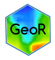

# gi621 

This package contains the data to help you complete exercise for the book *Practical Spatial Data Coastal and Marine Environment in R*, by Masumbuko Semba (Semba 2021). *Practical Spatial Data Coastal and Marine Environment in R* itself is available online at https://lugoga.github.io/geomarine/.

This package is a complement to, not a substitute of, *Practical Spatial Data Coastal and Marine Environment in R*. It only provides data for the exercise and solutions for it. Additional, the solutions use several packages that are not used in R4DS. You can install development version of **gi612** from github:

``` r
# install.packages("devtools")
devtools::install_github("lugoga/gi612Data")
```


## Citation

Please cite the package when you make use of its function. You can cite
in the format here below:


```r
Masumbuko Semba (2021). gi612: Data Package For GI 612 Course. R package version 0.1.0.
```

And the bibtex format

```r
@Manual{,
    title = {gi612: Data Package For GI 612 Course},
    author = {Masumbuko Semba},
    year = {2021},
    note = {R package version 0.1.0},
  }
```

